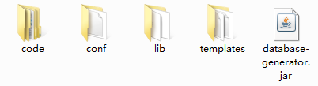
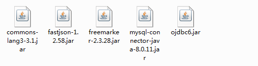

# DatabaseGenerator
### 自动生成java代码和H5页面

基于JavaFX图形界面功能实现。  

实现基于Oracle和Mysql数据库的数据库代码自动生成  

本项目的代码生成模板存在于***resource/generator/templates***中  

可以通过maven生成jar包运行。  

项目生成jar包后文件构造：  

其中lib的构造：  

conf文件夹中存在：config.properties文件，code文件夹中都为生成的代码，templates文件夹中存在模板文件

